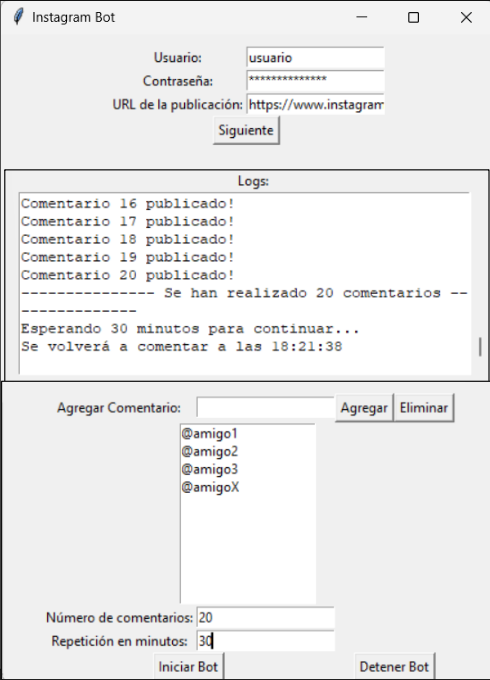
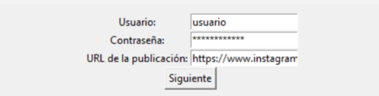
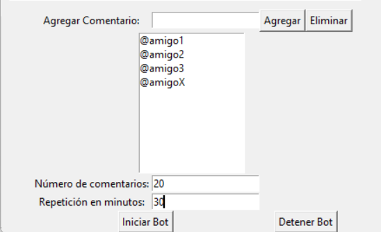
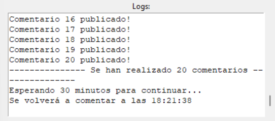

# Instagram Giveaway Automation



## Description
This project automates the process of participating in Instagram giveaways by utilizing Selenium for browser automation. It logs into Instagram, navigates to specified posts, and posts random comments from a user-defined list.

Designed to optimize giveaway entries, the bot includes functionalities for interval-based commenting and manual comment management through a user-friendly GUI. It integrates error handling and logging mechanisms to ensure smooth operation and user accountability.

In the first image above, you can see the program running in its full functionality. It is set up to log in with the user's credentials, post comments on a specified URL, randomly select from a list of four friends, and post 20 comments every 30 minutes.

## How to Use

### Step 1: Log In and Select the Post


The first step involves the user entering their Instagram username, password, and the URL of the post where they want to comment. This information is securely handled by the bot to automate the login and navigation process.

### Step 2: Add Comments


Next, the user must input the comments they want the bot to randomly select from and post. These comments can include tags of friends or any text the user wishes to include in the giveaway entries.

### Step 3: Monitor Activity


The final image shows the logging screen, where users can monitor all the actions performed by the bot. This screen provides real-time feedback on the number of comments posted, the status of each action, and additional information to help the user track the bot's performance.

## Requirements
- Selenium
- Tkinter
- Chromedriver

## Installation
1. Ensure Python is installed on your system.
2. Install the required libraries:

```
pip install selenium tkinter
```

3. Download the appropriate version of Chromedriver for your browser and ensure it's in your system's PATH.

## Usage
1. Run the script `main.py`.
2. Follow the steps outlined in the images above to input your credentials, post URL, and comments.
3. Start the automation and let the bot handle your giveaway entries, with comments posted at the specified intervals.

